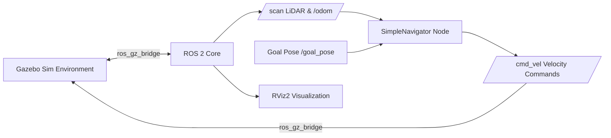

# 🚜 Autonomous 4WD Mobile Robot in ROS 2 & Gazebo

[](https://docs.ros.org/)
[](https://gazebosim.org/)
[](LICENSE)
[](http://lab.deepak-arkz.me/wheeled_robot_ros2/)

An autonomous 4-wheel drive (4WD) skid-steer mobile robot developed in **ROS 2** and **Gazebo**. Featuring real-time sensor fusion across LiDAR and RGB camera streams, ROS-Gz message bridging, 2D SLAM occupancy grid mapping, and a reactive Finite State Machine (FSM) obstacle avoidance navigator.

---

## 🌟 Key Features

- **4WD Skid-Steer URDF**: Detailed mechanical robot definition with 4-wheel drivetrain, inertia matrices, collision geometries, LiDAR tower, and front-mounted RGB camera.
- **Gazebo Sim Integration**: Custom physical simulation environment (`world.sdf`) with obstacles, wall perimeters, and realistic friction/contact dynamics.
- **Bi-Directional `ros_gz_bridge`**: Connects ROS 2 with Gazebo topics for `/cmd_vel`, `/odom`, `/scan`, `/tf`, `/joint_states`, and `/camera/image_raw`.
- **FSM Obstacle Avoidance Navigator (`SimpleNavigator`)**:
  - Multi-sector LiDAR point filtering (Front 80° cone, Left, Right sectors).
  - Dynamic buffer clearance (`safe_dist = 0.55m`).
  - Robust state machine handling `WAITING_FOR_GOAL`, `START_DELAY`, `MOVE_TO_GOAL`, `AVOID_OBSTACLE_TURN`, `CLEARING_OBSTACLE`, and `GOAL_REACHED_DELAY`.
  - Quaternion-to-Euler yaw extraction for goal heading calculation.
- **2D SLAM & Mapping**: Pre-mapped environment (`map_1784564885.yaml` / `.pgm`) ready for Nav2 waypoint navigation.
- **RViz Visualization**: Pre-configured displays for robot model, laser scan overlays, TF transforms, and live camera feed.

---

## 🏛️ System Architecture



---

## 📁 Repository Structure

```
wheeled_robot_ros2/
├── config/
│   └── ros_gz_bridge.yaml          # Topic mappings between Gazebo & ROS 2
├── launch/
│   ├── display.launch.py           # RViz visualization & robot_state_publisher
│   └── gazebo.launch.py            # World spawn, bridge launch & simulation
├── map/
│   ├── map_1784564885.pgm          # Occupancy grid map bitmap
│   └── map_1784564885.yaml         # Map metadata and resolution config
├── nodes/
│   └── obstacle_avoidance.py       # FSM reactive navigator & obstacle avoider
├── rviz/
│   ├── camera.rviz                 # RViz configuration with camera stream
│   └── config.rviz                 # Base RViz configuration
├── urdf/
│   └── four_wheel.urdf             # 4WD robot kinematics & sensor URDF
├── worlds/
│   └── world.sdf                   # Gazebo simulation world with obstacles
├── CMakeLists.txt                  # Build configuration
└── package.xml                     # ROS 2 package metadata
```

---

## ⚙️ Hardware & Sensor Bridge Mapping

| ROS 2 Topic | Gazebo Topic | Message Type | Direction |
| :--- | :--- | :--- | :--- |
| `/clock` | `/clock` | `rosgraph_msgs/msg/Clock` | Gazebo ➔ ROS 2 |
| `/cmd_vel` | `/cmd_vel` | `geometry_msgs/msg/Twist` | ROS 2 ➔ Gazebo |
| `/odom` | `/odom` | `nav_msgs/msg/Odometry` | Gazebo ➔ ROS 2 |
| `/tf` | `/model/four_wheel/tf` | `tf2_msgs/msg/TFMessage` | Gazebo ➔ ROS 2 |
| `/scan` | `/scan` | `sensor_msgs/msg/LaserScan` | Gazebo ➔ ROS 2 |
| `/joint_states` | `/joint_states` | `sensor_msgs/msg/JointState` | Gazebo ➔ ROS 2 |
| `/camera/image_raw` | `/camera/image_raw` | `sensor_msgs/msg/Image` | Gazebo ➔ ROS 2 |

---

## 🚀 Quick Start Guide

### 1. Requirements
- ROS 2 Humble / Iron
- Gazebo Sim (Fortress / Harmonic)
- `ros-humble-ros-gz` or equivalent bridge package

### 2. Build the Package
```bash
mkdir -p ~/ros2_ws/src
cd ~/ros2_ws/src
git clone https://github.com/Arkz-Deepak/wheeled_robot_ros2.git
cd ~/ros2_ws
colcon build --symlink-install --packages-select wheeled_robot_ros2
source install/setup.bash
```

### 3. Launch the Simulation
Launch Gazebo world and bridge all sensor streams:
```bash
ros2 launch wheeled_robot_ros2 gazebo.launch.py
```

### 4. Launch RViz Visualization
```bash
ros2 launch wheeled_robot_ros2 display.launch.py
```

### 5. Run the Autonomous FSM Navigator
```bash
ros2 run wheeled_robot_ros2 obstacle_avoidance.py
```

Send a goal pose via RViz `2D Goal Pose` or publish directly:
```bash
ros2 topic pub --once /goal_pose geometry_msgs/msg/PoseStamped "{header: {frame_id: 'map'}, pose: {position: {x: 2.0, y: 1.5, z: 0.0}}}"
```

---

## 👨‍💻 Author
- **Deepak R** ([@Arkz-Deepak](https://github.com/Arkz-Deepak))
- **Portfolio & Robotics Lab**: [lab.deepak-arkz.me](http://lab.deepak-arkz.me/)
